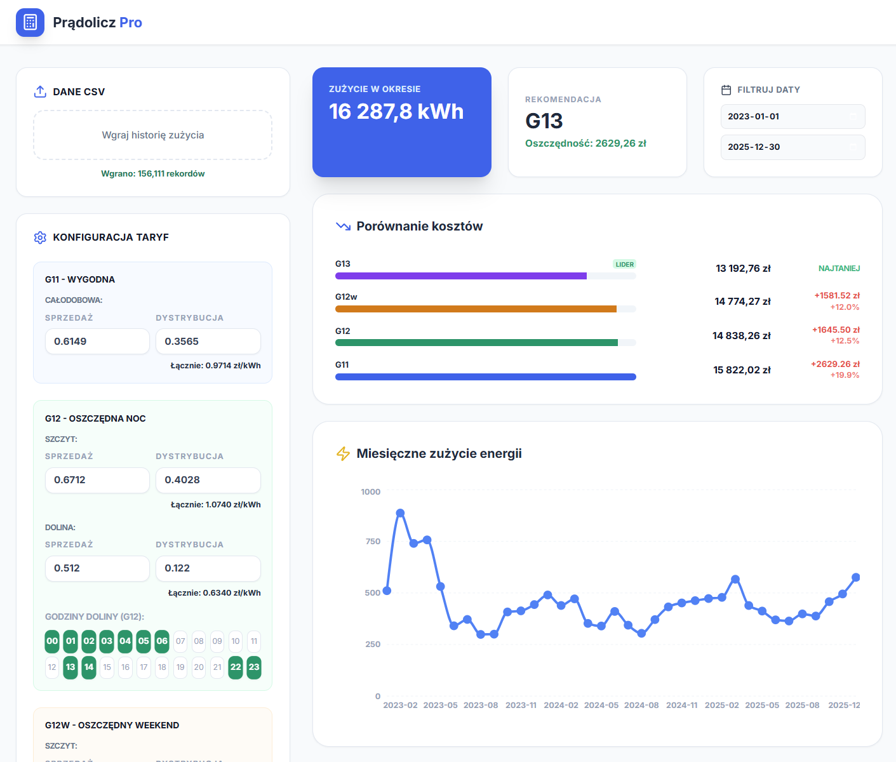

# Prądolicz Pro

Zaawansowane narzędzie webowe do precyzyjnej analizy kosztów energii elektrycznej w gospodarstwach domowych i firmach. Aplikacja pozwala na porównanie opłacalności najpopularniejszych taryf (G11, G12, G12w, G13) na podstawie rzeczywistych danych z licznika.



## Główne Funkcjonalności

- **Import danych CSV**: Obsługa standardowych plików z historią zużycia (kolumny `timestamp`, `kwh`).
- **Pełna konfiguracja cen**: Rozbicie na składnik sprzedaży i dystrybucji dla każdego progu cenowego.
- **Interaktywne harmonogramy**: Możliwość ręcznego zdefiniowania godzin "doliny" dla taryf G12 i G12w.
- **Zaawansowana logika G13**: Automatyczne uwzględnianie sezonowości (Lato/Zima) oraz dni wolnych od pracy zgodnie z polskim kalendarzem.
- **Wizualizacje**:
  - Porównanie całkowitych kosztów (Ranking).
  - Wykres radarowy (zegarowy) dobowego profilu zużycia.
  - Wykresy liniowe miesięcznej konsumpcji.

## Konfiguracja Taryf

Poniżej przedstawiono standardowe ustawienia taryf zaimplementowane w aplikacji:

<p align="center">
  
  
  
  
</p>

## Format danych wejściowych (CSV)

Plik powinien posiadać nagłówki i być oddzielony przecinkami:
```csv
timestamp,kwh
2023-01-14 21:56,0.09702
2023-01-14 22:06,0.14722
```

## Technologie

- **React 19** + **TypeScript**
- **Recharts** (Wykresy radarowe i liniowe)
- **Lucide React** (Ikony)
- **Tailwind CSS** (Interfejs użytkownika)
